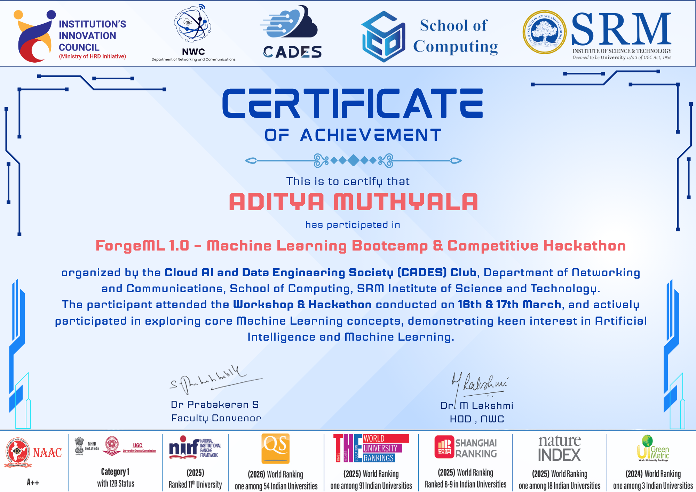

# 🛡️ ChurnGuard AI — Customer Churn Prediction System


> An intelligent end-to-end machine learning system to detect, analyze, and prevent customer churn for telecom companies.

---

## 📌 Problem Statement

Customer churn causes significant revenue loss for telecom companies. Acquiring a new customer costs 5-7x more than retaining an existing one. ChurnGuard AI predicts which customers are likely to churn — before it happens — enabling targeted retention strategies.

---

## 🎯 Features

| Feature | Description |
|---|---|
| 🔍 Churn Prediction | Predict Yes/No with probability score |
| 📊 Risk Dashboard | Full overview across all customers |
| ⚠️ Early Warning System | Flag customers with multiple risk signals |
| 👥 Segmentation | 6 high-risk customer segments |
| 💰 CLV Prioritization | Customer Lifetime Value + retention matrix |

---

## 🧠 ML Pipeline
```
Raw Data → EDA → Cleaning → Feature Engineering → SMOTE → Model Training → Evaluation → API
```

### Models Compared
| Model | CV AUC | Test AUC |
|---|---|---|
| Logistic Regression | 0.9088 | 0.8260 |
| Random Forest | 0.9254 | 0.8252 |
| **Gradient Boosting ✅** | **0.8998** | **0.8336** |
| XGBoost | 0.9239 | 0.8127 |

### Key Results
- **Test AUC-ROC: 0.8336**
- **No Overfitting: Train-Test gap = 0.0334**
- **High Risk Churn Rate: 65.96%**
- **Low Risk Churn Rate: 9.60%**

---

## 🔧 Feature Engineering

| Feature | Description | Importance |
|---|---|---|
| contract_risk | Risk score by contract type | 50.4% |
| tenure | Customer loyalty duration | 10.7% |
| total_services | Number of subscribed services | 1.9% |
| charge_per_tenure | Value perception ratio | - |
| is_new_customer | New customer flag | - |

---

## 🚀 Project Structure
```
ForgeML/
├── data/                   # Dataset files
├── src/
│   ├── eda.py              # Exploratory Data Analysis
│   ├── preprocess.py       # Data cleaning & encoding
│   ├── features.py         # Feature engineering
│   ├── train.py            # Model training
│   └── evaluate.py         # Model evaluation
├── models/                 # Saved model & scaler
├── pages/
│   ├── 1_🔍_Predict.py     # Single prediction page
│   ├── 2_📊_Dashboard.py   # Churn dashboard
│   ├── 3_⚠️_Early_Warning.py # Early warning system
│   ├── 4_👥_Segmentation.py # Customer segmentation
│   └── 5_💰_CLV.py         # CLV & retention strategy
├── app.py                  # Streamlit main app
├── main.py                 # FastAPI backend
├── verify.py               # Model verification script
└── requirements.txt
```

---

## ⚙️ Setup & Installation
```bash
# Clone the repository
git clone https://github.com/aditya3275/Customer-Churn-Prediction.git
cd Customer-Churn-Prediction

# Create virtual environment
python3 -m venv venv
source venv/bin/activate

# Install dependencies
pip install -r requirements.txt

# Download dataset from Kaggle
# https://www.kaggle.com/datasets/blastchar/telco-customer-churn
# Place as data/telco_churn.csv
```

---

## 🏃 Running the Project

### Step 1 — Train the model
```bash
python3 src/eda.py
python3 src/preprocess.py
python3 src/features.py
python3 src/train.py
python3 src/evaluate.py
```

### Step 2 — Verify the model
```bash
python3 verify.py
```

### Step 3 — Start FastAPI backend
```bash
uvicorn main:app --port 8000
```

### Step 4 — Start Streamlit frontend
```bash
streamlit run app.py
```

### Step 5 — Test the API
```bash
curl -X POST "http://127.0.0.1:8000/predict" \
-H "Content-Type: application/json" \
-d '{
  "gender": "Male",
  "SeniorCitizen": 1,
  "Partner": "No",
  "Dependents": "No",
  "tenure": 1,
  "PhoneService": "Yes",
  "MultipleLines": "Yes",
  "InternetService": "Fiber optic",
  "OnlineSecurity": "No",
  "OnlineBackup": "No",
  "DeviceProtection": "No",
  "TechSupport": "No",
  "StreamingTV": "Yes",
  "StreamingMovies": "Yes",
  "Contract": "Month-to-month",
  "PaperlessBilling": "Yes",
  "PaymentMethod": "Electronic check",
  "MonthlyCharges": 105.0,
  "TotalCharges": 105.0
}'
```

---

## 📊 API Endpoints

| Endpoint | Method | Description |
|---|---|---|
| `/` | GET | Health check |
| `/health` | GET | Model info + AUC score |
| `/predict` | POST | Churn prediction |

### Sample Response
```json
{
  "churn_prediction": "Yes",
  "churn_probability": 0.8992,
  "risk_category": "High Risk",
  "confidence": "89.92%"
}
```

---

## 🛠️ Tech Stack

| Category | Technology |
|---|---|
| Language | Python 3.14 |
| ML | Scikit-learn, XGBoost |
| Imbalance | SMOTE (imbalanced-learn) |
| API | FastAPI + Pydantic |
| Frontend | Streamlit |
| Data | Pandas, NumPy |
| Visualization | Matplotlib, Seaborn |
| Deployment | ngrok |

---

## 🏆 Achievement

This project was built as part of **ForgeML 1.0 – Machine Learning Bootcamp & Competitive Hackathon** organized by the **Cloud AI and Data Engineering Society (CADES) Club**, Department of Networking and Communications, School of Computing, **SRM Institute of Science & Technology** (March 16-17, 2026).



## 👥 Team

**Team ForgeML** — Hackathon 2026

---

## 📄 License

MIT License